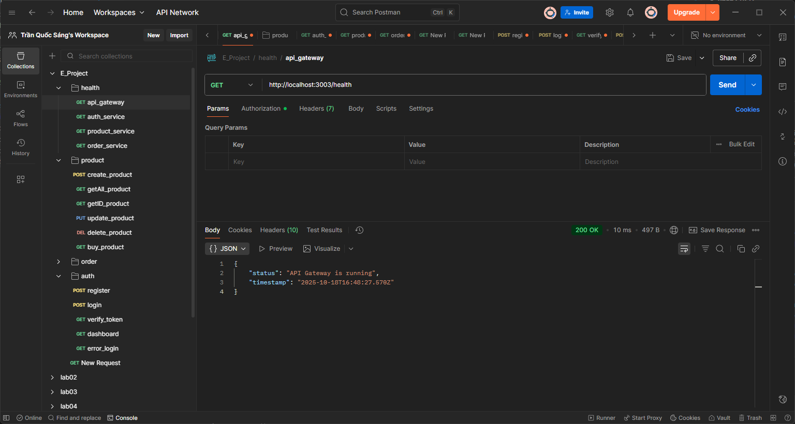
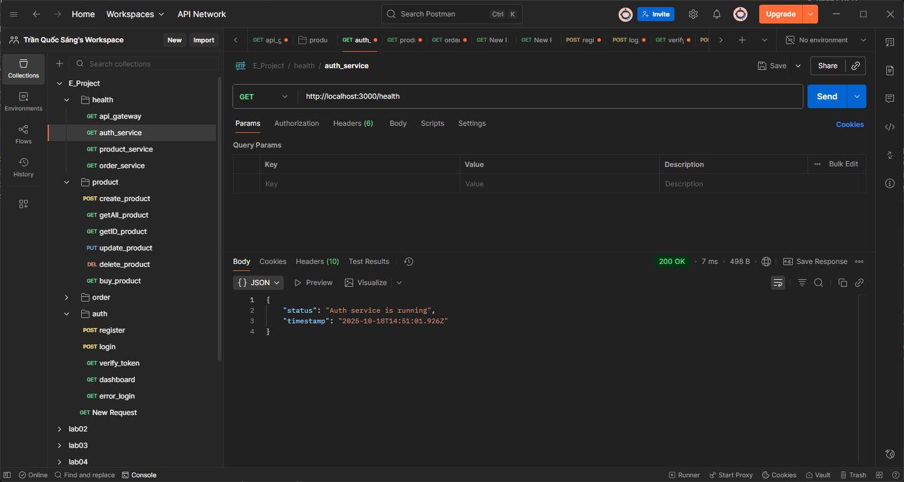
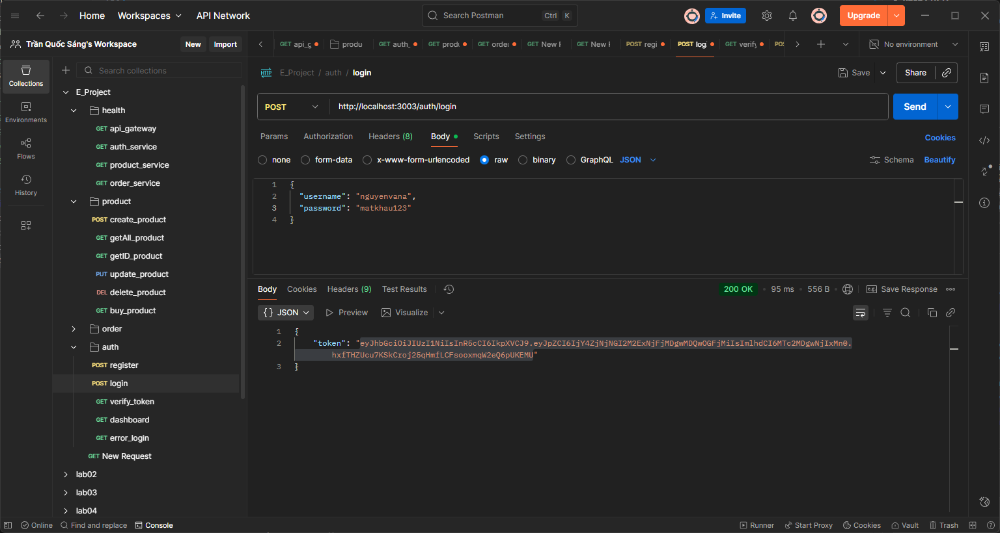
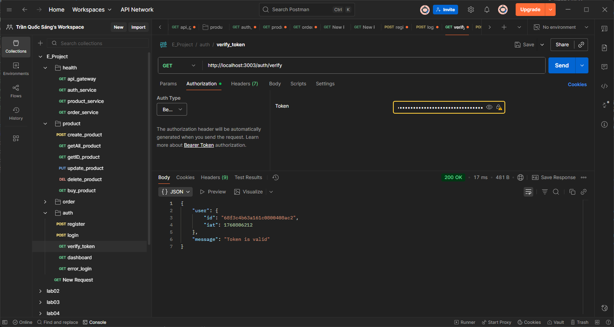
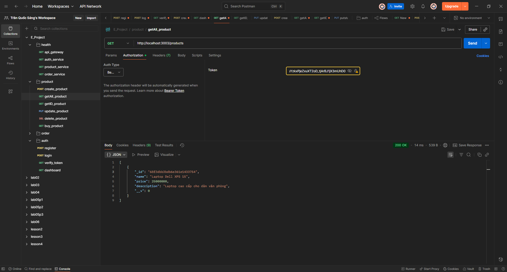
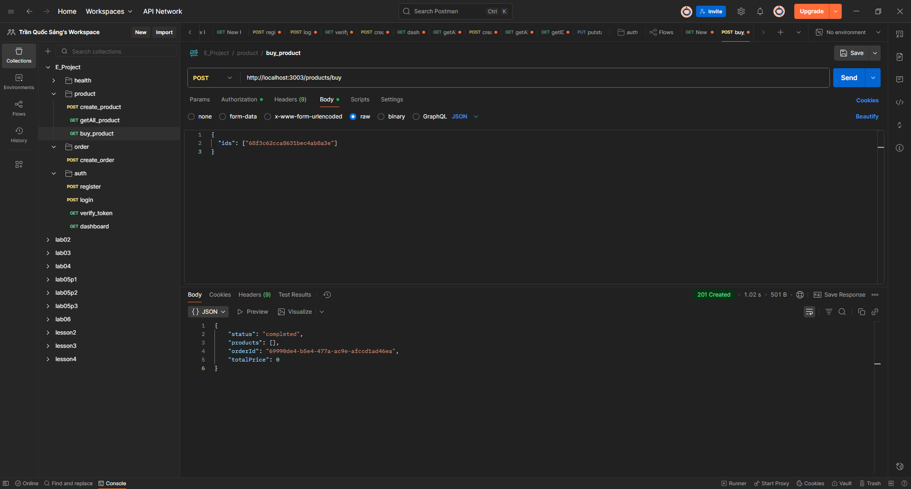
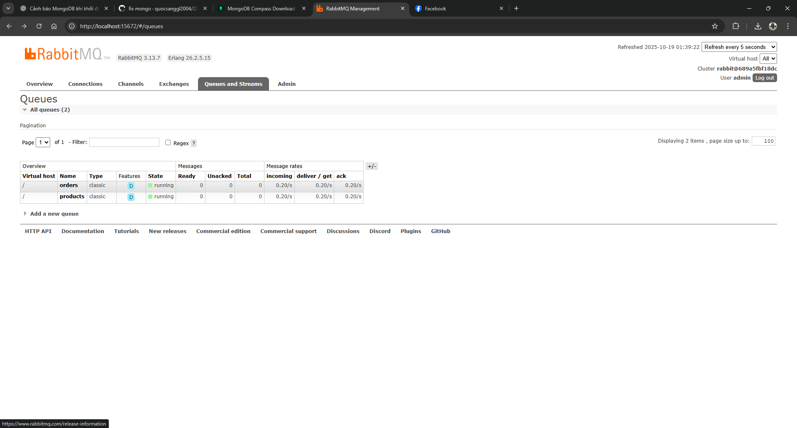
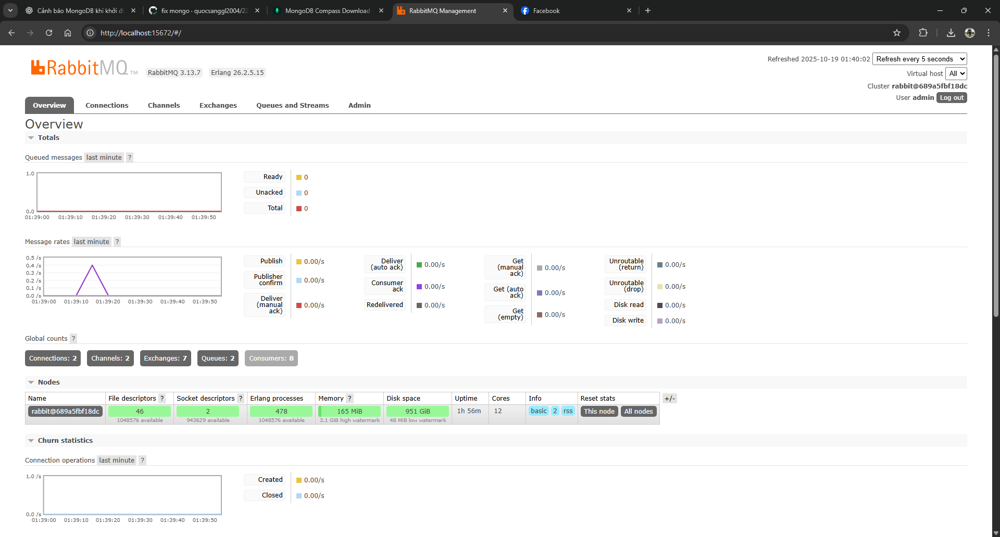
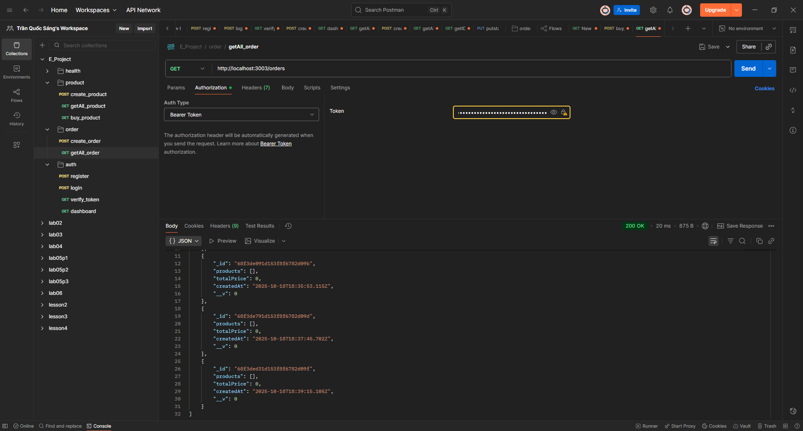
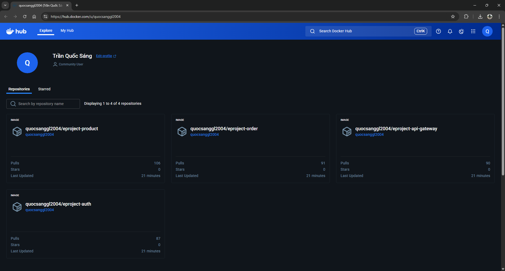

# EProject Phase 1 - Microservices E-Commerce

Dự án xây dựng hệ thống thương mại điện tử theo kiến trúc microservices với Docker và CI/CD.

---

## 📖 Tổng Quan Dự Án

### Hệ thống giải quyết vấn đề gì?
Xây dựng một nền tảng e-commerce đơn giản với các chức năng:
- Đăng ký và đăng nhập người dùng
- Quản lý sản phẩm (thêm, xem, sửa, xóa)
- Đặt hàng sản phẩm
- Thông báo đơn hàng qua message queue

### Công nghệ sử dụng
- **Backend:** Node.js + Express.js
- **Database:** MongoDB
- **Message Queue:** RabbitMQ
- **Containerization:** Docker + Docker Compose
- **CI/CD:** GitHub Actions
- **API Testing:** Postman

---


## 🏗️ Kiến Trúc Hệ Thống

```
                    ┌─────────────┐
                    │   Client    │
                    │  (Postman)  │
                    └──────┬──────┘
                           │
                           ▼
                  ┌────────────────┐
                  │  API Gateway   │  Port 3003
                  │   (Routing)    │
                  └────────┬───────┘
                           │
        ┌──────────────────┼──────────────────┐
        ▼                  ▼                  ▼
   ┌────────┐        ┌──────────┐       ┌────────┐
   │  Auth  │        │ Product  │       │ Order  │
   │ :3000  │        │  :3001   │       │ :3002  │
   └────┬───┘        └────┬─────┘       └────┬───┘
        │                 │                   │
        └─────────┬───────┴─────────┬─────────┘
                  ▼                 ▼
           ┌──────────┐      ┌──────────┐
           │ MongoDB  │      │ RabbitMQ │
           │  :27017  │      │  :5672   │
           └──────────┘      └──────────┘
```

### Các Services

| Service | Port | Chức năng |
|---------|------|-----------|
| **API Gateway** | 3003 | Nhận requests từ client và route đến service tương ứng |
| **Auth Service** | 3000 | Xử lý đăng ký, đăng nhập, tạo JWT token |
| **Product Service** | 3001 | Quản lý sản phẩm (CRUD) |
| **Order Service** | 3002 | Quản lý đơn hàng, gửi thông báo qua RabbitMQ |
| **MongoDB** | 27017 | Lưu trữ dữ liệu (users, products, orders) |
| **RabbitMQ** | 5672, 15672 | Message queue cho communication giữa services |

### Cách các services giao tiếp
1. **Client → API Gateway:** HTTP requests
2. **API Gateway → Services:** Routing requests đến đúng service
3. **Services → MongoDB:** Lưu/đọc dữ liệu
4. **Order Service → RabbitMQ:** Gửi thông báo khi có đơn hàng mới
5. **Services ↔ Services:** JWT token để authenticate

---

## 🚀 Hướng Dẫn Chạy Dự Án

### Yêu cầu
- Docker Desktop đã cài đặt và đang chạy
- Git đã cài đặt

### Bước 1: Clone dự án
```bash
git clone https://github.com/foxxiee04/22640841-TranQuocSang_EProject.git
cd EProject-Phase-1
```

### Bước 2: Chạy Docker Compose
```bash
docker-compose up -d
```

Lệnh này sẽ:
- Tải images (MongoDB, RabbitMQ)
- Build 4 services (API Gateway, Auth, Product, Order)
- Khởi động tất cả containers

### Bước 3: Kiểm tra services đã chạy
```bash
docker-compose ps
```

Kết quả mong đợi: 6 containers với status **Up (healthy)**

### Bước 4: Kiểm tra health
Mở browser và truy cập:
- API Gateway: http://localhost:3003/health
- Auth Service: http://localhost:3000/health
- Product Service: http://localhost:3001/health
- Order Service: http://localhost:3002/health

Tất cả phải trả về JSON: `{ "status": "... is running" }`

### Bước 5: Truy cập RabbitMQ Management UI 

**Khi nào cần mở?** Khi test API `/buy` để xem message queue hoạt động

**URL:** http://localhost:15672

**Thông tin đăng nhập:**
- Username: `admin`
- Password: `password`

**Cách kiểm tra RabbitMQ đang hoạt động:**

1. **Sau khi đăng nhập**, vào tab **Queues** (phía trên)
2. Bạn sẽ thấy 2 queues:
   - `orders` - Nhận message từ Product service khi user mua hàng
   - `products` - Gửi kết quả về Product service sau khi tạo order

3. **Test thử:**
   - Gọi API `/buy` trong Postman (xem TEST 5 bên dưới)
   - Quay lại RabbitMQ UI → Tab **Queues**
   - Xem cột **Ready** và **Total** để thấy số message đã xử lý
   - Click vào queue name → Tab **Get messages** để xem nội dung message

**Ý nghĩa:**
- **Message trong queue "orders"**: Product service đã gửi thông tin đơn hàng
- **Message được consume**: Order service đã nhận và xử lý
- **Message trong queue "products"**: Order service gửi kết quả về

---

## 📡 Test API với Postman

### Lưu ý quan trọng
- **Tất cả requests đi qua API Gateway:** `http://localhost:3003`
- **Cần JWT token** cho các API: Products, Orders
- Test theo đúng thứ tự dưới đây

---
### TEST 0: Kiểm tra trạng thái hoạt động các service
-api_gateway: http://localhost:3003/health


-auth_service: http://localhost:3000/health


-product_service: http://localhost:3001/health


-order_service: http://localhost:3002/health


### TEST 1: Đăng ký tài khoản

**Nghiệp vụ:** Tạo tài khoản người dùng mới trong hệ thống

**Request:**
```
Method: POST
URL: http://localhost:3003/auth/register
Headers:
  Content-Type: application/json
Body (JSON):
{
  "username": "nguyenvana",
  "password": "matkhau123"
}
```

**Kết quả mong đợi:**
- Status: `200 OK`


### TEST 2: Đăng nhập

**Nghiệp vụ:** Đăng nhập với tài khoản đã tạo để lấy JWT token

**Request:**
```
Method: POST
URL: http://localhost:3003/auth/login
Headers:
  Content-Type: application/json
Body (JSON):
{
  "username": "nguyenvana",
  "password": "matkhau123"
}
```

**Kết quả mong đợi:**
- Status: `200 OK`

**⚠️ Quan trọng:** Copy `token` để dùng cho các requests tiếp theo!



### TEST 3: Verify Token

**Nghiệp vụ:** Kiểm tra token có hợp lệ không

**Request:**
```
Method: GET
URL: http://localhost:3003/auth/verify
Headers:
  Authorization: Bearer <PASTE_TOKEN_Ở_ĐÂY>
```

**Kết quả mong đợi:**
- Status: `200 OK`



### TEST 4: Tạo sản phẩm mới

**Nghiệp vụ:** Thêm sản phẩm vào hệ thống

**Request:**
```
Method: POST
URL: http://localhost:3003/products
Headers:
  Content-Type: application/json
  Authorization: Bearer <TOKEN>
Body (JSON):
{
  "name": "Laptop Dell XPS 15",
  "price": 25000000,
  "description": "Laptop cao cấp cho dân văn phòng"
}
```

**Kết quả mong đợi:**
- Status: `201 Created`


### TEST 5: Xem danh sách sản phẩm

**Nghiệp vụ:** Lấy tất cả sản phẩm trong hệ thống

**Request:**
```
Method: GET
URL: http://localhost:3003/products
Headers:
  Authorization: Bearer <TOKEN>
```

**Kết quả mong đợi:**
- Status: `200 OK`


### TEST 6: Tạo đơn hàng trực tiếp

**Nghiệp vụ:** Tạo đơn hàng trực tiếp vào Order Service (không qua RabbitMQ)

**Request:**
```
Method: POST
URL: http://localhost:3003/orders
Headers:
  Content-Type: application/json
  Authorization: Bearer <TOKEN>
Body (JSON):
{
  "products": ["68f3c62cca8631bec4ab8a3e"],
  "totalPrice": 25000000
}
```

**Kết quả mong đợi:**
- Status: `201 Created`


### TEST 7: Mua hàng qua RabbitMQ (API /buy)

**Nghiệp vụ:** Mua sản phẩm, hệ thống tự động tạo order qua RabbitMQ

**Request:**
```
Method: POST
URL: http://localhost:3001/products/buy
Headers:
  Content-Type: application/json
  Authorization: Bearer <TOKEN>
Body (JSON):
{
  "ids": ["68f3c62cca8631bec4ab8a3e"]
}
```

**Lưu ý:** Thay `ids` bằng array các `_id` sản phẩm từ TEST 5

**Kết quả mong đợi:**
- Status: `201 Created`


**Flow hoạt động:**
1. Product service gửi message vào queue `orders`
2. Order service nhận message và tạo order trong MongoDB
3. Order service gửi kết quả vào queue `products`
4. Product service trả response về client

---

### TEST 9: Kiểm tra RabbitMQ

**Nghiệp vụ:** Xem message queue đã xử lý đơn hàng từ TEST 8

**Cách kiểm tra:**
1. Mở browser: http://localhost:15672
2. Login: `admin` / `password`
3. Click tab **Queues**
4. Xem 2 queues:
   - `orders` - Nhận message từ Product service
   - `products` - Gửi kết quả về Product service
5. Click vào queue → Tab **Get messages** để xem nội dung

**Kết quả mong đợi:**
- Queues tồn tại và đã xử lý messages


- Trong **Overview** tab thấy biểu đồ message rate

---

### TEST 10: Xem danh sách đơn hàng

**Nghiệp vụ:** Lấy tất cả đơn hàng trong hệ thống

**Request:**
```
Method: GET
URL: http://localhost:3003/orders
Headers:
  Authorization: Bearer <TOKEN>
```

**Kết quả mong đợi:**
- Status: `200 OK`
- Response: Array các đơn hàng


## 🔐 Xử Lý Lỗi Thường Gặp

### Lỗi 401 Unauthorized
**Nguyên nhân:** Thiếu hoặc sai JWT token

**Giải pháp:**
1. Đăng nhập lại để lấy token mới (TEST 2)
2. Kiểm tra header `Authorization: Bearer <token>`
3. Đảm bảo có dấu cách giữa `Bearer` và `<token>`

### Lỗi 404 Not Found
**Nguyên nhân:** ID không tồn tại hoặc sai URL

**Giải pháp:**
1. Kiểm tra lại `_id` từ response trước đó
2. Đảm bảo URL đúng: `http://localhost:3003/...`

### Lỗi 400 Bad Request
**Nguyên nhân:** Dữ liệu gửi lên sai format hoặc thiếu field

**Giải pháp:**
1. Kiểm tra Body có đúng JSON format không
2. Kiểm tra các field bắt buộc: `username`, `password`, `name`, `price`, etc.

### Docker containers không start
**Giải pháp:**
```bash
# Stop tất cả
docker-compose down

# Xóa volumes (reset database)
docker-compose down -v

# Start lại
docker-compose up -d
```

---

## 🧪 CI/CD với GitHub Actions

### Workflow tự động
Mỗi khi push code lên GitHub, hệ thống tự động:

1. **Chạy Tests**
   - Auth service: 5 tests
   - Product service: 2 tests
   - **Tổng: 7 tests**

2. **Build Docker Images**
   - Build 4 images: auth, product, order, api-gateway
   - Tag với `latest` và `commit-sha`

3. **Push lên Docker Hub**
   - Repository: https://hub.docker.com/u/quocsanggl2004
   - Images: `eproject-auth`, `eproject-product`, `eproject-order`, `eproject-api-gateway`

### Xem kết quả CI/CD
1. Vào GitHub repository
2. Click tab **Actions**
3. Xem workflow runs




---

## 📂 Cấu Trúc Thư Mục

```
EProject-Phase-1/
├── .github/
│   └── workflows/
│       └── ci-cd.yml          # GitHub Actions workflow
├── api-gateway/
│   ├── Dockerfile
│   ├── index.js
│   └── package.json
├── auth/
│   ├── Dockerfile
│   ├── index.js
│   ├── package.json
│   └── src/
│       ├── app.js
│       ├── controllers/
│       ├── models/
│       ├── services/
│       └── test/
├── product/
│   ├── Dockerfile
│   ├── index.js
│   ├── package.json
│   └── src/
│       ├── app.js
│       ├── controllers/
│       ├── models/
│       ├── routes/
│       ├── services/
│       └── test/
├── order/
│   ├── Dockerfile
│   ├── index.js
│   ├── package.json
│   └── src/
│       ├── app.js
│       ├── models/
│       └── utils/
├── docker-compose.yml         # Docker orchestration
├── README.md                  

```

---

## 🎓 Kiến Thức Đã Áp Dụng

### 1. Microservices Architecture
- Chia hệ thống thành các services độc lập
- Mỗi service có database riêng
- Services giao tiếp qua HTTP và Message Queue

### 2. Design Patterns
- **API Gateway Pattern:** Centralized entry point
- **Repository Pattern:** Tách business logic và data access
- **Message Queue Pattern:** Async communication

### 3. Docker & Containerization
- Mỗi service chạy trong container riêng
- Docker Compose quản lý multi-container
- Container networking và service discovery

### 4. CI/CD
- Automated testing với GitHub Actions
- Automated build và push Docker images
- Continuous integration trên mỗi commit

### 5. Authentication & Security
- JWT (JSON Web Tokens) cho stateless authentication
- Password hashing với bcrypt
- Token-based authorization giữa services

---

## 👨‍💻 Tác Giả

**Tên:** Trần Quốc Sáng  
**MSSV:** 22640841  
**GitHub:** https://github.com/foxxiee04/22640841-TranQuocSang_EProject  
**Docker Hub:** https://hub.docker.com/u/foxxiee04

---


## 📝 Ghi Chú

- **Database credentials:** 
  - MongoDB username: `admin`
  - MongoDB password: `password`
  
- **RabbitMQ credentials:**
  - Username: `admin`
  - Password: `password`

- **JWT Secret:** Mỗi service có secret riêng (nên thống nhất trong production)

---


